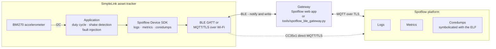

# TI SimpleLink Asset Tracker - remote diagnostics with Spotflow

A battery-powered asset tag for the TI LP-EM-CC2340R5, LP-EM-CC2340R53 and
LP-EM-CC35X1 whose entire uplink is **diagnostics**: what the device knows about its
own health, sent somewhere a firmware engineer can read it without a cable. CC23x0
uses a BLE gateway. CC35x1 can use either a BLE gateway or direct MQTT/TLS over Wi-Fi,
selected at build time.

Sensor readings and position fixes are simulated and stay on the device. What leaves it
is whether those subsystems are working — logs, metrics and, when it crashes, a coredump.
The firmware contains a **deliberate memory-safety bug** so the crash path can be
demonstrated end to end: shake the device, it hard faults, and the coredump arrives in
the cloud symbolicated.

This is the firmware shown at the conference demo. The CC2340 variants run on real
hardware and everything in the original BLE demo has been observed on a board. CC35x1
support currently has build verification only; its hardware validation status is listed
under [CC35x1 limitations](#cc35x1-limitations).

---

## Architecture



The CC2340 and CC35x1 BLE images are peripherals; a **gateway** in range relays framed
CBOR between them and the platform. The CC35x1 Wi-Fi image connects directly to the
platform using MQTT over TLS.

Both directions matter. Upward go logs, metrics and coredumps. Downward goes
configuration — which is how the sent log level is raised on a device already in the
field, with no reflash and no physical access.

---

## What the device reports

Nothing about the cargo. Everything about the device.

**Logs.** Boot banner with reset cause, shake events, sensor failures, link changes.
DEBUG is compiled in but not sent; the sent level is raised from the cloud, which is how
you get detail out of a device already in the field without reflashing it.

**Metrics.** Eight from the application, four from the Spotflow SDK:

| metric | answers |
| --- | --- |
| `boot_count` | is it restarting, and how often? |
| `battery_v` | how long has it got left? (float, real PMU reading) |
| `radio_on_pct` | how much of the reporting window was the monitored link up? |
| `sensor_error_streak` | is the sensor flaky, or gone? |
| `sensor_errors` (label `kind`) | what is the bus doing? |
| `shakes_detected` | has it been handled roughly? |
| `shake_peak_g` | how hard was the worst of it? (float) |
| `link_disconnects` (label `reason`) | why does the link keep dropping? (HCI code for BLE, zero for IP) |
| `boot_reset` (label `reason`) | SDK: POR, PIN, SOFTWARE, DEBUG |
| `connection_transport_connected` | SDK: is the selected transport connected? |
| `heap_free_bytes`, `heap_allocated_bytes` | SDK: memory headroom |

That is twelve registered metrics, which is exactly
`CONFIG_SPOTFLOW_METRICS_MAX_REGISTERED`. The registry is full: adding one means removing
one.

**Coredumps.** On a fault the SDK writes a dump, reboots, and uploads it over the selected
transport. With the ELF uploaded to Spotflow as a symbol file, the stack symbolicates to
function and line.

---

## What it does

**Duty cycle.** One thread, every 10 seconds: read the sensor, attempt a position fix
every third cycle, report, sleep.

**Shake detection.** While otherwise idle the accelerometer is sampled every 20 ms — the
10-second reporting cycle cannot see a 2–5 Hz shake. A swing is a hard excursion either
side of rest; six in quick succession make a shake, and the detector then keeps counting
until the shaking stops, so the reported swing count, duration and peak describe the whole
event rather than its first second. The accelerometer runs at ±16 g so a hard shake does
not clip.

**The deliberate bug.** `format_shake_label()` in `app/src/shake_detect.c` copies a
34-byte annotation into a 16-byte buffer, bounded by the length of the source instead of
the size of the destination. The 18 bytes that do not fit land on the function pointer
that follows the buffer in the struct; calling it branches into the text of the annotation
and the device hard faults. There is no MPU on this part, so the write itself is never
caught — the corruption is only discovered when the clobbered pointer is used.

The bug lives *inside the detection logic*, which is the point: the feature that makes the
product valuable is the feature that brings the device down. Set
`CONFIG_APP_SHAKE_RECORD_BUG=n` for shake detection without the crash.

**Fault injection.** One button. Button 1 crashes the device in the way selected by
`CONFIG_APP_FAULT_KIND_*`, by default the shake-label overflow above. Green LED means the
sensor is working, red means it has failed enough consecutive reads to be called
unusable — the same bar the log uses.

**Resilience.** A sensor that fails to initialise does not stop the device: it runs, the
reads fail, the streak climbs, the red LED comes on and it says what is wrong with it.
`sensor_init()` is retried every 12 consecutive failures, so a sensor that comes back — a
reseated wire — is picked up without a reboot. A genuinely wedged bus cannot be recovered
in software on this part: `i2c_recover_bus()` is `NULL` in the CC23xx driver, so only a
power cycle clears it, and the log says so rather than claiming otherwise.

---

## Hardware

| | |
| --- | --- |
| Boards | TI **LP-EM-CC2340R5**, **LP-EM-CC2340R53**, or **LP-EM-CC35X1/CC3551E** |
| Sensor | Bosch **BMI270** accelerometer breakout on I²C — **optional** |

Both CC2340 boards work. Each has a standard Zephyr board configuration and overlay under
`app/boards/`; Zephyr selects them from `-b`. Their current resource values and hardware
layout intentionally match because the boards have the same flash, pinout, Cortex-M0+
and TI link-layer library. Only the SRAM differs, and both profiles retain the smaller
board's limits so the demo behaves identically on either unit.

The CC35x1 profile uses the simulated sensor by default because no BMI270 wiring has been
defined for that LaunchPad. It targets `lp_em_cc35x1/cc3551e` and supports two separate
images: direct Wi-Fi/MQTT and gateway-relayed BLE.

**The accelerometer is optional on CC2340.** Both ways of running this reach the same crash
through the same code, so pick whichever matches the hardware you have. CC35x1 always
uses the simulated backend in the supplied profile:

| | build | trigger the crash |
| --- | --- | --- |
| **With a BMI270** | default | shake the device |
| **Without one** | `-DCONFIG_APP_SENSOR_SIM=y` | press **button 1** |

Button 1 completes a synthetic shake, so detection, reporting and the faulting code all
run exactly as they do for a real one. The coredump is indistinguishable — same function,
same stack, same program counter, verified on hardware. Shaking a real sensor is only
more convincing to watch.

### Wiring

| BMI270 module | LaunchPad |
| --- | --- |
| VCC | BoosterPack pin 1 (3.3 V) |
| GND | BoosterPack pin 20 |
| SCL | BoosterPack pin 9 (DIO24) |
| SDA | BoosterPack pin 10 (DIO0) |

Default address `0x68`; the breakout carries its own pull-ups. Interrupt pins are unused.

---

## Prerequisites

### CC2340

**Zephyr SDK 0.16.8.** Zephyr 3.7 pins it, and SDK 1.0.x declares itself incompatible with
anything asking for < 1.0. Both can be installed side by side.

```sh
curl -LO https://github.com/zephyrproject-rtos/sdk-ng/releases/download/v0.16.8/zephyr-sdk-0.16.8_macos-aarch64_minimal.tar.xz
curl -LO https://github.com/zephyrproject-rtos/sdk-ng/releases/download/v0.16.8/toolchain_macos-aarch64_arm-zephyr-eabi.tar.xz
tar -xJf zephyr-sdk-0.16.8_macos-aarch64_minimal.tar.xz -C ~
tar -xJf toolchain_macos-aarch64_arm-zephyr-eabi.tar.xz -C ~/zephyr-sdk-0.16.8
~/zephyr-sdk-0.16.8/setup.sh -c
```

**`crc_tool`.** The cc23x0 build has a mandatory post-link step that patches CRC32s into
the CCFG region; the boot ROM verifies them, so an image built without it does not run.
The PyPI package pins `lief==0.12.3`, which has no wheels for recent Python:

```sh
pip install lief
pip install --no-deps ti-simplelink-crc-tool
```

**TI UniFlash** for flashing (provides DSLite).

### CC35x1

CC35x1 uses a separate workspace because it requires TI's Zephyr 4.4 downstream while
the established CC2340 builds remain pinned to Zephyr 3.7. Install:

- Python 3.12 and West. `west packages pip --install` installs the complete set of Python
  dependencies, including `pyelftools` required by the flash runner.
- Zephyr SDK 1.0.1 with the `arm-zephyr-eabi` toolchain.
- TI SimpleLink Wi-Fi Toolbox 4.3.23. Its installation directory must be on `PATH` so
  TI's mandatory signing and vendor-image tools can run after linking.
- An external LP-XDS110 or LP-XDS110ET probe connected to the board's 20-pin J7 header.

The authoritative TI/Spotflow setup is
[Set up flashing for TI CC35x1](https://docs.spotflow.io/guides/texas-instruments/cc35x1-setup).
The compatibility changes and first-flash sequence below were validated against that
guide and the functional Spotflow sample in `spotflow/zephyr/samples/logs`.

---

## Build

### CC2340

This repository is a **west manifest repository** — clone it *through* west, not directly,
or you get the application with no Zephyr and no modules.

```sh
mkdir cc2340-tracker && cd cc2340-tracker
python3 -m venv .venv && .venv/bin/pip install west
.venv/bin/west init -m https://github.com/jmasek/oss_ti_demonstration.git --mr main
.venv/bin/west update
.venv/bin/pip install -r zephyr/scripts/requirements-base.txt
```

`west update` fetches Zephyr and the modules at the revisions `west.yml` pins. Both pins
are deliberate and neither floats:

- **Zephyr** — TI's `simplelink-zephyr` downstream is the only Zephyr with a Bluetooth LE
  controller for cc23x0. Upstream has none.
- **Spotflow device SDK** — pinned to the commit carrying CC2340R5 support.

Then, with `.venv/bin` on `PATH` so the post-link step finds `crc_tool`:

```sh
west build -b lp_em_cc2340r5 asset_tracker/app -d build/tracker     # or lp_em_cc2340r53
```

Without a BMI270 wired up, add `-- -DCONFIG_APP_SENSOR_SIM=y` for the simulated backend:

```sh
west build -b lp_em_cc2340r5 asset_tracker/app -d build/sim -- -DCONFIG_APP_SENSOR_SIM=y
```

Expect roughly **246 KB flash** either way, and:

| Board | RAM |
| --- | --- |
| `lp_em_cc2340r5` | 36512 B of 36864 — **99%** |
| `lp_em_cc2340r53` | 46624 B of 65536 — 71% |

That 99% is not a typo, and it is the binding constraint on this port; `west build -t
ram_report` shows where it goes.

The CC2340R53 is not using 10 KB more for anything of ours. The entire difference is one
symbol — TI's Bluetooth link-layer heap, which their own board defconfig sizes at 16 KB
there against 6.25 KB on the CC2340R5, because on a 36 KB part there was nowhere else to
take it from. Every other byte of RAM is identical between the two images. The remaining
headroom on the CC2340R53 is left unspent on purpose: raising the ATT MTU would make
coredump uploads far faster on one board only, and a demo whose timings depend on which
unit you picked up is worse than a uniformly slow one.

### CC35x1

Initialize a second workspace with the dedicated manifest. Do not update the CC2340
workspace to these revisions. On Windows PowerShell:

```powershell
New-Item -ItemType Directory -Path C:\spotflow-cc35
Set-Location C:\spotflow-cc35
py -3.12 -m venv .venv
.\.venv\Scripts\Activate.ps1
python -m pip install west

west init `
    --manifest-url https://github.com/jmasek/oss_ti_demonstration.git `
    --manifest-rev main `
    --manifest-file west-cc35x1.yml `
    .
west update --fetch-opt=--depth=1 --narrow
west packages pip --install
west sdk install --version 1.0.1 --toolchains arm-zephyr-eabi

$env:PATH = "C:\ti\simplelink_wifi_toolbox_win_4_3_23;$env:PATH"
simplelink-wifi-toolbox --version
```

Keep the build directory short on Windows. Paths generated by the TI host stack can
otherwise exceed tool limits.

#### Toolbox 4.3.23 compatibility changes

The pinned TI Zephyr release predates Toolbox 4.3.23 and does not work with it unchanged.
Apply these four changes after `west update` and before building. They are required for
both transport variants:

1. In `modules/hal/ti/simplelink_lpf3/CMakeLists.txt`, change
   `CONFIG_BT_HCI_TI_CC3XXX` to `CONFIG_BT_HCI_TI_CC35XX`.
2. In `zephyr/soc/ti/simplelink/cc35xxe/toolbox.cmake`, add `--device CC35XXE`
   immediately after `flash-images-builder` in all eight `build` and `sign` commands.
3. In
   `zephyr/boards/ti/lp_em_cc35x1/config/flash/is25wj032f/external_memory_configurator.json`,
   add `"vendor_bl3_size": 0` and `"ti_fw_in_vendor_image": false` to `inputs`, preserving
   valid JSON commas.
4. In `zephyr/scripts/west_commands/runners/simplelink_toolbox.py`, remove
   `--full_flash_erase` from both command lists in `do_initial_programming()`.

These are the exact changes present in the validated workspace. Without them, BLE can
compile incompatible LPF3 sources, image generation can reject the missing device, the
memory schema can fail validation, or initial programming can attempt an erase forbidden
in the board's unactivated lifecycle. A later `west update` can overwrite these dependency
edits; check and reapply them before rebuilding.

Create the short build root once:

```powershell
New-Item -ItemType Directory -Path C:\b -Force
```

For the direct Wi-Fi/MQTT image, copy `asset_tracker/app/credentials-sample.conf` to
`asset_tracker/app/credentials.conf` and fill in the SSID, WPA2-Personal password,
Spotflow ingestion key and device ID. The real file is ignored by git. Then build:

```powershell
west build --pristine --board "lp_em_cc35x1/cc3551e" `
    --build-dir C:\b\cc35-wifi asset_tracker\app -- `
    '-DEXTRA_CONF_FILE=transport-wifi.conf' `
    '-DAPP_CREDENTIALS_FILE=credentials.conf'
```

The BLE image needs no Wi-Fi or ingestion credentials because its gateway owns the cloud
connection:

```powershell
west build --pristine --board "lp_em_cc35x1/cc3551e" `
    --build-dir C:\b\cc35-ble asset_tracker\app -- `
    '-DEXTRA_CONF_FILE=transport-ble.conf'
```

The credentials file is included only when explicitly passed to
`APP_CREDENTIALS_FILE`, so an existing file cannot leak into a BLE build. Build directories
contain all effective Kconfig values in `zephyr/.config`, including plaintext Wi-Fi and
Spotflow credentials for MQTT builds. Treat those directories as sensitive, do not publish
them, and rotate any credential exposed from one.

Verified build sizes with the pinned revisions are:

| CC35x1 variant | Flash | RAM |
| --- | ---: | ---: |
| Wi-Fi/MQTT | 1,021,312 B of 4,088 KB | 314,872 B of 508 KB |
| BLE | 923,652 B of 4,088 KB | 263,252 B of 508 KB |

---

## Point it at your Spotflow workspace

1. Create a workspace at [spotflow.io](https://spotflow.io) and an **ingestion key**.
2. Set a unique device ID. For Wi-Fi, set it in `app/credentials.conf`; for BLE, set it in
   `app/prj.conf`:

   ```
   CONFIG_SPOTFLOW_DEVICE_ID="asset-tracker-01"
   ```

3. Upload the matching build's ELF as the firmware version's **symbol file**. Use
   `build/tracker/zephyr/zephyr.elf` for CC2340, `C:\b\cc35-wifi\zephyr\zephyr.elf` for
   CC35x1 Wi-Fi, or `C:\b\cc35-ble\zephyr\zephyr.elf` for CC35x1 BLE. Without the exact
   ELF for that build ID, a coredump arrives without a symbolicated call stack.

The BLE variants need a **gateway** to relay their traffic to Spotflow. The simplest
option is the Spotflow web app, which speaks Web Bluetooth straight from the browser - see
[Use the Spotflow web app as a BLE gateway](https://docs.spotflow.io/fundamentals/bluetooth-low-energy#use-the-spotflow-web-app-as-a-ble-gateway).

A terminal equivalent is included here for machines where the browser will not cooperate:

```sh
export SPOTFLOW_INGEST_KEY=sf_ikv1_...
python3 tools/spotflow_ble_gateway.py
```

---

## Flash

### CC35x1 first flash

Connect both the board and an LP-XDS110 or LP-XDS110ET probe, with the probe attached to
the board's 20-pin J7 header. Ensure Toolbox 4.3.23 is still on `PATH`.

CC35x1 activation is a **one-time lifecycle change** from `OPERATIONAL` to `DEPLOYED` and
programs device credentials. The command below uses TI's SDK example key and is suitable
for development boards, not production provisioning. Do not repeat activation after the
device reaches `DEPLOYED`.

Choose either completed CC35x1 build, use an absolute report path, and activate once:

```powershell
$buildDir = (Resolve-Path C:\b\cc35-wifi).Path
simplelink-wifi-toolbox programmer -i XDS110 -param1 auto activation `
    --prog_inst_image_path "$buildDir\zephyr\flash\programming_instructions_image.sign.bin" `
    --report_file_name_path "$buildDir\activation_report.txt" `
    --verbose
```

Toolbox resolves relative report paths against its installation directory and can fail to
write the report after activation, so keep the path absolute. Confirm there was no earlier
error in the output; a generic final `Success` does not override `Factory programming
failed` or a lifecycle error.

After successful activation, perform factory programming once. This writes the boot
sector, TI bootloader, wireless firmware, flash layout and application:

```powershell
west flash --build-dir $buildDir -- --initial-programming
```

All later application updates, including switching between BLE and Wi-Fi images, use a
regular flash:

```powershell
west flash --build-dir C:\b\cc35-wifi
west flash --build-dir C:\b\cc35-ble
```

If multiple XDS110 probes are attached, replace `auto` in the standalone activation command
with the target probe's serial number. For factory or regular `west flash`, append
`-- --serial <XDS110-serial>`. The runner programs
`zephyr/flash/vendor_image.sign.bin`; do not substitute `zephyr.bin`. See the
[Spotflow CC35x1 flashing guide](https://docs.spotflow.io/guides/texas-instruments/cc35x1-setup)
before recovering any activation or lifecycle failure.

Zephyr uses UART1 at 115200 baud, 8 data bits, no parity and one stop bit. UART1 is routed
through J4 and J6 to J7; open the **XDS110 Class Application/User UART** port before reset
to capture startup output. D2, D9 and D10 normally remain lit and are not application fault
indicators. Zephyr currently supports flashing but not debugging this board.

### CC2340

The repository flashing helper and target configurations cover both CC2340 boards:

```sh
asset_tracker/tools/flash.sh build/tracker
```

The script reads `CONFIG_BOARD` back out of the build and picks the matching target
configuration, because the two parts need different `.ccxml` files — the `<platform>`
block names the device. Underneath it is one DSLite call:

```sh
~/ti/uniflash_<version>/dslite.sh --mode flash \
    --config=asset_tracker/tools/cc2340r5_xds110.ccxml --verbose -u \
    build/tracker/zephyr/zephyr.hex
```

Pass `--verbose` even if you do not want the noise: without it DSLite prints nothing at
all, success included.

Both `.ccxml` files were exported from the UniFlash GUI. The one setting that matters is
**SWD Mode Settings = 2**: these parts are SWD-only, and a config left at the JTAG default
fails to connect with `Error -1170`. If a connect fails with `Error -615` instead, the
target is not answering at all — check the board's power switch and that the debugger's
SWD jumpers are fitted before touching the clock setting it suggests.

Flash **`zephyr.hex`**, never `zephyr.bin` — the `.bin` is over a gigabyte, because
objcopy zero-fills the gap between flash at `0x0` and the CCFG region at `0x4E020000`.

---

## Run it

For Wi-Fi, no gateway is needed. Open the serial console before reset and verify that the
board associates with the configured 2.4 GHz WPA2-Personal network, obtains an IPv4
address, and establishes MQTT/TLS. Then check **Device Events** for the configured device
ID. Association alone is not proof of a working cloud connection.

For BLE, open the **BLE Gateway** page in the Spotflow Web App, select an ingestion key,
scan for **Asset Tracker**, connect, and keep the page open while testing. The browser owns
the BLE connection and cloud relay. After a crash and reboot, reconnect the gateway
manually so the stored coredump can upload.

Within a minute you should see:

```
asset tracker up: boot 1, reset POR
supply 3.104 V
```

Now trigger the crash — **shake the device** if you wired up a BMI270, or **press button
1** if you did not. Either way:

```
shake detected: 19 swings, peak 4.538 g
shake: 19 swings over 3099 ms, peak 4.538 g
Device crashed.
Core dump upload started.
Coredump successfully sent.
```

On the hardware-validated CC2340 build, the whole crash-to-cloud cycle takes about ten
seconds over BLE. Opening the dump in Spotflow gives:

```
#0  0x63657464 in ?? ()
#1  0x........ in format_shake_label () at app/src/shake_detect.c:298
```

(The frame 1 address varies between builds; the program counter in frame 0 does not.)

Frame 0 is not a function because the program counter is not an address — `0x63657464` is
ASCII `"dtec"`, four bytes from the middle of *"rough handling de**tec**ted in transit"*.
The annotation overran its buffer onto the function pointer, and the device branched into
the text of its own log message. Line 298 is the call through the clobbered pointer; line
296 is the `memcpy` that clobbered it. The bug is legible directly from the PC.

---

## Expected log lines that are not faults

**`Failed to publish heartbeat: -11`, twice, shortly after every boot.** `-11` is
`-EAGAIN`. The SDK schedules its first heartbeat immediately at init, roughly 30 ms into
boot, long before a gateway can have connected; it retries at 10, 100 and 1000 ms, gives
up, and logs twice. Exactly two lines per boot, harmless, and it stops once a gateway is
present.

**`no fix after 5000 ms, 0 sats`.** The simulated GPS failing, as designed. There is no
GNSS receiver on this board.

**`no watchdog available`.** `wdt0` is disabled in the board devicetree. The watchdog is
deliberately off: nothing feeds it while the fault handler writes a coredump, and a reset
mid-write would truncate the dump the demo exists to show.

---

## Repository layout

```
app/
  prj.conf                             portable demo behavior
  transport-wifi.conf                  CC35x1 direct MQTT/TLS variant
  transport-ble.conf                   CC35x1 BLE variant
  credentials-sample.conf              committed Wi-Fi/Spotflow credential template
  boards/lp_em_cc2340r5.conf           R5 resource and platform profile
  boards/lp_em_cc2340r5.overlay        R5 flash layout and BMI270 wiring
  boards/lp_em_cc2340r53.conf          R53 resource and platform profile
  boards/lp_em_cc2340r53.overlay       R53 flash layout and BMI270 wiring
  boards/lp_em_cc35x1_cc3551e.conf     CC35x1 resource and platform profile
  boards/lp_em_cc35x1_cc3551e.overlay  CC35x1 radio and flash layout
  src/
    main.c                     startup
    tracker.c                  the duty cycle
    shake_detect.c             shake detection, and the deliberate bug
    sensor_bmi270.c            BMI270 driver
    sensor_sim.c               simulated backend
    diag_metrics.c/h           the metric catalogue and its rationale
    faults.c                   button-driven fault injection
    power_model.c              supply measurement and radio duty accounting
    wifi_link.c                CC35x1 association, DHCP and reconnect handling
    boot_info.c, link_monitor.c, geo_sim.c, session_meta.c
tools/
  flash.sh                     flashing helper, picks the .ccxml from the build
  cc2340r5_xds110.ccxml        DSLite target configuration
  cc2340r53_xds110.ccxml       the same, for the CC2340R53
  spotflow_ble_gateway.py      host-side BLE → Spotflow relay
west.yml                       pinned Zephyr and Spotflow SDK revisions
west-cc35x1.yml                separate pinned Zephyr 4.4 CC35x1 workspace
```

`prj.conf` says what the firmware does: enabled diagnostics, metric catalogue, reporting
policy and log behavior. Each `boards/<board>.conf` says what that target can afford:
Bluetooth buffers, Spotflow queues, heap and stack sizes, entropy setup and platform
workarounds. The corresponding overlay owns the target's flash map and sensor wiring.

The R5 and R53 files intentionally duplicate today's values. This keeps each profile
self-contained, follows Zephyr's automatic board-file selection, and prevents a future
CC35x1 profile from inheriting CC23x0 limits merely because those limits were once common.
`CMakeLists.txt` only adds the untracked credentials file when present and compiles the
Wi-Fi association helper for MQTT builds.

---

## Notable constraints

- **RAM is 99% used** on the CC2340R5. Buffer sizes, queue depths and stacks are tuned to
  fit. Almost any addition fails to link. The CC2340R53 has headroom, but the firmware is
  built to the smaller budget so the two boards behave the same.
- **Every BMI270 register write is one I²C transaction.** The stock Zephyr driver uses
  `i2c_burst_write_dt()`, which this controller splits in two; the BMI270 needs the
  register address and data in a single transaction. Split writes *return success without
  changing the register*, so the part answers, reports the right chip ID, and silently
  never initialises. This application drives the sensor directly for that reason.
- **ARMv6-M has no unaligned access and no MPU.** Memory corruption is discovered when the
  damage is used, not when it is done.
- **ATT MTU is 23 bytes**, the BLE minimum, chosen to save RAM. That caps throughput at
  roughly 444 B/s and is why a coredump takes seconds rather than milliseconds.

### CC35x1 limitations

- The Wi-Fi driver can starve Zephyr's queued RX worker during bursts. The MQTT variant
  uses `CONFIG_NET_TC_RX_COUNT=0` to process packets inline until TI provides backpressure.
- The BLE controller currently requires the shared TI Wi-Fi host infrastructure. The BLE
  image does not associate with an AP, but the resulting binary still contains that
  infrastructure and its Zephyr Mbed TLS entropy path.
- Secure BLE pairing, bonding and privacy are disabled because the current CC35x1 HSM/PSA
  integration is not compatible with the Zephyr Bluetooth host. The Spotflow gateway does
  not require pairing or bonding.
- Zephyr emits a generic `CONFIG_TIMER_RANDOM_GENERATOR` security warning in both CC35x1
  builds. MQTT/TLS uses `CONFIG_MBEDTLS_PSA_CRYPTO_EXTERNAL_RNG` with the CC35x1 entropy
  path, while BLE security is disabled. Do not add pairing or other application crypto
  that relies on Zephyr's timer generator without configuring a suitable CSPRNG.
- Hardware validation remains outstanding for Wi-Fi association, DHCP, MQTT/TLS,
  reconnect behavior, BLE advertising/GATT and coredump upload. Both variants have been
  compiled through TI's signing and vendor-image generation steps.
- Application link diagnostics observe the BLE connection in BLE builds and Zephyr L4/IP
  availability in Wi-Fi builds. `connection_transport_connected`, reported by the SDK,
  is the authoritative MQTT session metric. `radio_on_pct` is a link-up estimate, not
  measured physical RF airtime.

---

## Licensing

**This repository is Apache-2.0** — see [`LICENSE`](LICENSE). Apache-2.0 because it is
what Zephyr itself uses, so the application and the RTOS it is built against carry the
same terms.

The dependencies are *not* vendored here; `west update` fetches each one from its own
repository, under its own licence:

| Component | Source | Licence |
| --- | --- | --- |
| This application | here | Apache-2.0 |
| Zephyr RTOS (TI `simplelink-zephyr`) | `TexasInstruments/simplelink-zephyr` | Apache-2.0 |
| Spotflow Device SDK | `spotflow-io/device-sdk` | **BUSL-1.1** |

### The Spotflow Device SDK is under the Business Source License

Worth reading before you build on this, because it is not a permissive licence. The terms
as published by Spotflow, s.r.o.:

- **Additional Use Grant** — the SDK may be used, copied, modified and distributed *solely
  to enable interaction with the Spotflow Platform*. Using it with another cloud service
  or platform, or for a purpose not directly related to the Spotflow Platform, requires
  written consent.
- **Change Date** — four years after a version is published, it converts to **Apache-2.0**
  automatically.
- Non-production use is permitted outright; the grant above is what permits limited
  production use.

In practice: running this firmware against your own Spotflow workspace is exactly what the
grant covers. Retargeting it at a different monitoring backend is not, and needs a
conversation with Spotflow first — `hello@spotflow.io`.

The full text ships with the SDK at `modules/lib/spotflow/LICENSE.MD` once `west update`
has run.
